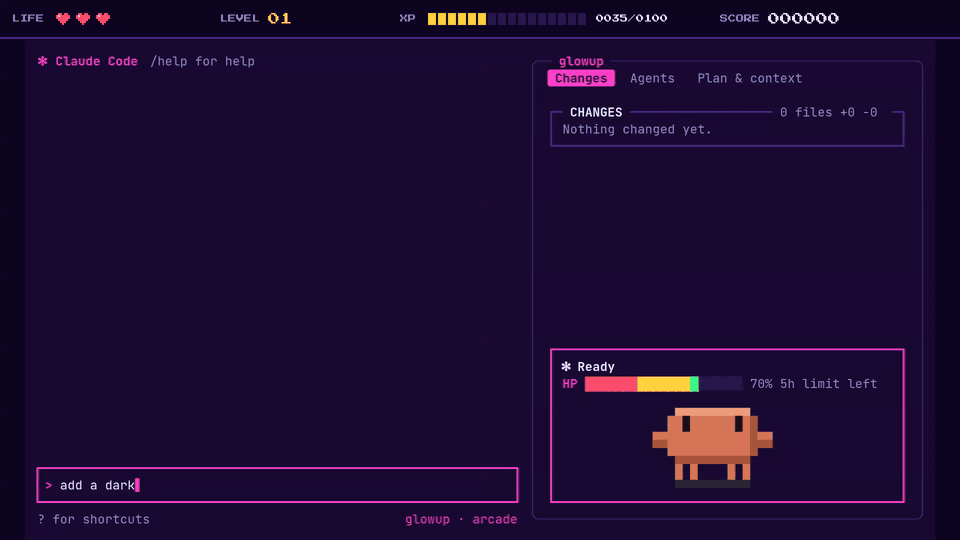
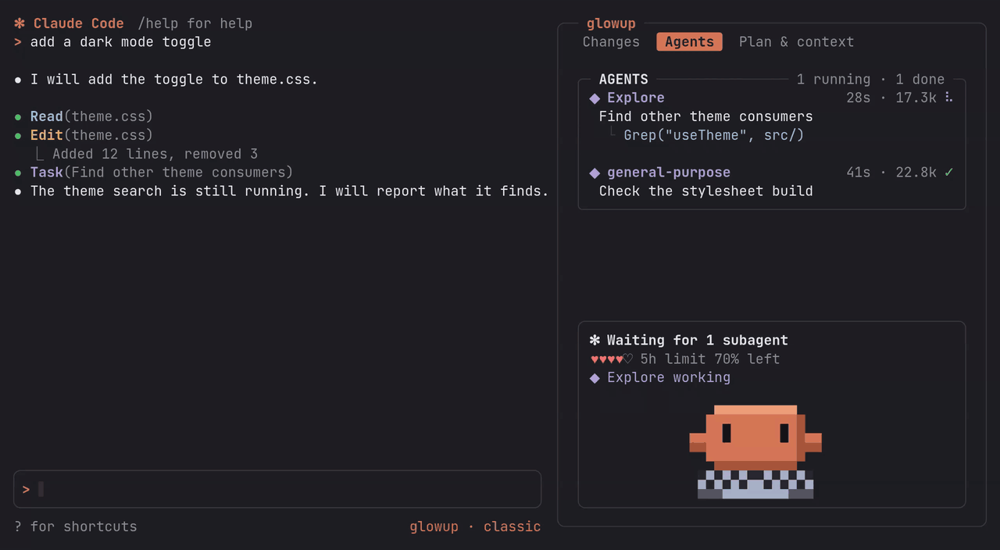

<div align="center">

# glowup

**A glow-up for Claude Code.** A live pane for changes, subagents and context, a one-line activity band, and themes you write as JSON and share by URL.

[](https://github.com/NovusEdge/glowup/actions/workflows/ci.yml)
[](https://github.com/NovusEdge/glowup/releases/latest)
[](LICENSE)
[](docs/install.md)

[Docs site](https://novusedge.github.io/glowup/) &nbsp;|&nbsp; [Latest release](https://github.com/NovusEdge/glowup/releases/latest)

</div>



<p align="center"><sub>The cyberpunk theme, pane docked: a fix goes in, a test fails, then passes, and a subagent searches on the side.</sub></p>

glowup is a Claude Code mod. It adds to the terminal UI and leaves your transcript and prompt where they are.

## What you get

<table>
<tr>
<td width="50%" valign="top">

### The cockpit pane

Three tabs. Press the number key or click.

- **Changes** answers "what did Claude touch?" Files with `+added −removed` counts from git.
- **Agents** answers "what are the subagents doing?" Name, time, tokens, and the tool each is running now.
- **Plan & context** answers "how far along are we, and how full is the window?" The task list and a context bar.

</td>
<td width="50%" valign="top">


<sub>Changes tab, with the status box below it.</sub>

</td>
</tr>
<tr>
<td width="50%" valign="top">



<sub>Agents tab: one subagent, 32 seconds in, mid-grep.</sub>

</td>
<td width="50%" valign="top">

### The activity band

One line above the prompt while Claude works. It shows the current action, running subagents, plan progress, and five hearts for the context you have left. Each heart is 20% of the window.


</td>
</tr>
<tr>
<td width="50%" valign="top">

### Themes

A theme is one JSON file: colors, a few glyphs, spinner words and band hearts. Four presets ship. A theme can `extends` another, so you write only what differs. Share one by hosting the file at an `https://` URL.

</td>
<td width="50%" valign="top">

### The status line

By default glowup adds one quiet entry under the prompt (`◆ editing · ctx 48%`) and leaves your status line alone. If you want glowup to draw the whole line, opt in with `/glowup statusline on`. `/glowup statusline restore` puts yours back.

</td>
</tr>
</table>

## Install

You need Claude Code 2.1.288 or later. In Claude Code:

```text
/plugin marketplace add NovusEdge/glowup
/plugin install glowup@glowup
```

Run `/glowup` with no arguments to print the usage. To run from a clone instead:

```sh
git clone https://github.com/NovusEdge/glowup
cd glowup
claude --plugin-dir .
```

More in [Install](docs/install.md).

## Commands

| Command | What it does |
| --- | --- |
| `/glowup theme <name>` | Switch theme. Saved for the next session. |
| `/glowup theme list` | List built-in and installed themes. A filled dot marks the current one. |
| `/glowup theme add <url>` | Install a theme file from an `https://` URL. |
| `/glowup pane` | Open or close the glowup pane. |
| `/glowup motion reduced` | Turn glowup's animation off. |
| `/glowup motion full` | Turn it back on. |
| `/glowup statusline on` | Ask first, then let glowup draw your status line. |
| `/glowup statusline restore` | Put your own status line back. |

Details are in [Commands](docs/commands.md).

## Themes

Presets: `classic` is Claude Code's own palette. The other three extend it.

| Preset | Accent |
| --- | --- |
| `classic` | `#d77757` |
| `cyberpunk` | `#ff2bd6` |
| `vaporwave` | `#ff71ce` |
| `high-contrast` | `#ffff00` |

A minimal theme. Save it as `~/.claude/glowup/themes/ember.json`; the file name is the theme name.

```json
{
  "name": "ember",
  "extends": "cyberpunk",
  "colors": { "accent": "#ff8a4c" },
  "spinner": { "words": ["Smoldering", "Glowing"] }
}
```

Then run `/glowup theme list` and `/glowup theme ember`.

To install someone else's theme, host the JSON at an `https://` URL and run:

```text
/glowup theme add https://example.com/ember.json
/glowup theme ember
```

`theme add` refuses files over 64 KB and names that clash with a preset. A theme holds data only; nothing in it runs.

A theme you pick with `/glowup theme` is stored, and it overrides the theme chosen in the Claude Code settings menu. This is deliberate. There is no command to clear the stored choice.

Full guide: [Making a theme](docs/themes.md) and the [theme reference](docs/theme-reference.md).

## Layout by terminal width

glowup picks a layout from your terminal width. Your transcript and prompt never move.

| Tier | When | What you see |
| --- | --- | --- |
| Wide | The pane is docked beside the transcript | The full pane. No band, since the pane shows the same things. |
| Medium | 80 columns or more, pane not docked | The one-line band. The pane is a drawer you open with `/glowup pane`. |
| Compact | Under 80 columns | The band, cut to fit. The drawer is small: a tab strip and at most six rows. |


The pane docks in fullscreen, at 144 columns or more, or from 110 columns once you have opened it yourself. See [Layout](docs/layout.md).

## Accessibility

- `/glowup motion reduced` (or the `reducedMotion` setting) turns off the spinner and shimmer. glowup does not flash.
- The `high-contrast` theme uses pure white text and fully saturated colors.
- Under 80 columns, every line is cut to fit with an ellipsis. Color is never the only signal: states also have glyphs and words.

See [Accessibility](docs/accessibility.md).

## Roadmap

Coming, in no promised order and with no dates:

- Pixel pets that act out tool calls: Clawd, Kit and Blip.
- Speech bubbles for the pets.
- Easter eggs.
- Full skin: themed message and tool rows and prompt border.

Also planned: a diff view in the Changes tab and opening an agent from the Agents tab. See [Roadmap](docs/roadmap.md).

## Contributing

Run `just --list` to see the dev recipes. `just setup` installs dependencies, `just ci` runs what CI runs, and `just dev` opens Claude Code with your checkout loaded. See [CONTRIBUTING.md](CONTRIBUTING.md). Report vulnerabilities as described in [SECURITY.md](SECURITY.md).

## License

[MIT](LICENSE)
