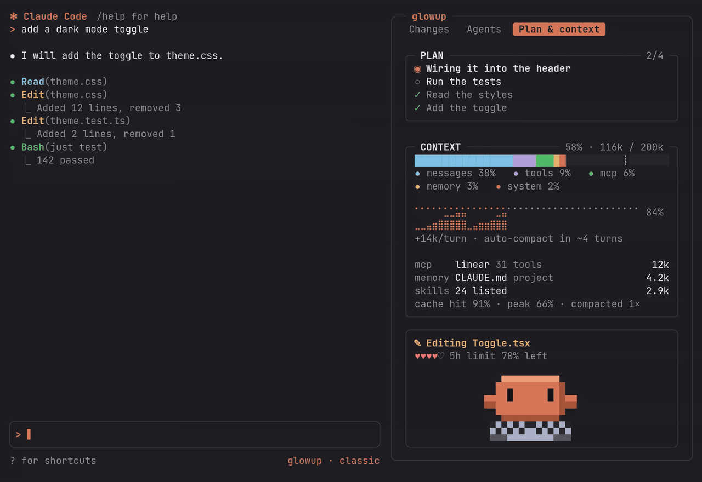

<div align="center">

# glowup

A Claude Code mod that adds a side pane for changed files, subagents and context use, an activity line above the prompt, packs and themes written as JSON, and a pixel pet named Clawd.

[](https://github.com/NovusEdge/glowup/actions/workflows/ci.yml)
[](https://github.com/NovusEdge/glowup/releases/latest)
[](LICENSE)
[](docs/install.md)

[Docs site](https://glowup.khimani.dev/) &nbsp;|&nbsp; [Latest release](https://github.com/NovusEdge/glowup/releases/latest)

</div>


<p align="center"><sub>A cut of the launch video, in the arcade pack with the pane docked: Claude edits a file, a test fails and costs a life, the fix passes, and Clawd hops as the level goes up. The full video also switches packs and shows the Plan &amp; context tab.</sub></p>

glowup draws around Claude Code's transcript and prompt without moving them.

## What you get

<table>
<tr>
<td width="50%" valign="top">

### The pane

The pane has three tabs, each drawn as a box in your pack's border style.

- **Changes** lists the files Claude edited or created, with added and removed line counts from git.
- **Agents** lists the subagents with their elapsed time, token count and the tool each one is running.
- **Plan & context** shows Claude's task list, and below it a context bar split by what is filling the window, a chart of context use over the session, how many turns remain before auto-compact, and the heaviest sources you can trim.

Under the tabs, a status box shows the current action, the running subagents, and a row of hearts for the usage you have left on whichever of the 5-hour and weekly limits is tighter. On an API key the row shows what the session has spent instead.

</td>
<td width="50%" valign="top">


<sub>Changes tab, with the status box below it: Done, the usage hearts, and Clawd.</sub>

</td>
</tr>
<tr>
<td width="50%" valign="top">


<sub>Agents tab: one subagent mid-grep, one finished.</sub>

</td>
<td width="50%" valign="top">

### The band

When the pane is not docked, a single line above the prompt shows the same summary while Claude works: the current action, running subagents, plan progress, and five hearts for the context left, each worth 20% of the window.


</td>
</tr>
<tr>
<td width="50%" valign="top">



<sub>Plan & context tab, one compaction into the session.</sub>

</td>
<td width="50%" valign="top">

### The context box

The context box shows what is filling the window and when it will run out.

- The `┊` on the bar and the dashed line on the chart mark where auto-compact runs.
- The line under the chart gives the growth per turn and the turns left before auto-compact.
- Below that are the three biggest sources you can trim, such as an MCP server's tools, a `CLAUDE.md` or the skill listing.

</td>
</tr>
<tr>
<td width="50%" valign="top">

### Packs and themes

A pack sets colors, transcript row styles, border shape and spinner under one name. A theme is just the palette part: colors, a few glyphs, spinner words and the heart characters. Both are JSON files that can `extends` another, so a custom one only lists what it changes, and either can be shared by hosting the file at an `https://` URL.

</td>
<td width="50%" valign="top">

### The status line

While Claude or a subagent is working, glowup adds an entry under the prompt and clears it when the work is done. Its fields and their order are yours to pick, from activity, context, 5-hour and weekly usage, cost, branch and a few more. On first run glowup asks once whether it should draw your whole status line; if you say no, your existing one is left alone.

</td>
</tr>
</table>

## Install

glowup needs Claude Code 2.1.289 or later.

```sh
curl -fsSL https://glowup.khimani.dev/install.sh | sh
```

The installer previews each choice while you pick a pack, a pet and a couple of extras, then installs the mod with Claude Code's own `claude plugin` commands. It runs from a temp folder and does not need sudo or leave anything on your PATH. To read the script before running it, pipe it to `less` instead of `sh`.

To install from inside Claude Code instead:

```text
/plugin marketplace add NovusEdge/glowup
/plugin install glowup@glowup
```

To run from a clone:

```sh
git clone https://github.com/NovusEdge/glowup
cd glowup
claude --plugin-dir .
```

If a session loads both an installed copy and a clone, the clone wins and the installed copy turns itself off. [Install](docs/install.md) covers installer options, settings and removal.

## Using it

`/glowup` on its own lists the handful of commands most people need, and `/glowup config` opens a pane where you pick a pack, spinner and pet, type exact colors, and set up the band, tabs and status line. Everything else, including installing shared packs and themes, overriding single colors and exporting to Konsole, is in [Commands](docs/commands.md).

glowup's settings also appear in Claude Code's `/plugin` menu. A change there and a `/glowup` command set the same saved choice, so whichever you made last is the one in effect. Changes made in `/plugin` apply at the next session start or after `/reload-plugins`.

## Packs and themes

Four packs ship: classic (the default, which keeps Claude Code's own look), crt, cozy and arcade.

```text
/glowup pack arcade
```


You can mix parts of different packs, put one of seven color themes on top, or override single colors. To make your own, ask Claude: glowup ships a skill that writes packs from a palette, an image or a description, and adjusts existing ones ("make arcade less pink"). `/glowup import` also converts Ghostty and base16 color schemes.

See [Packs](docs/packs.md) and [Making a theme](docs/themes.md).

## Clawd


Clawd lives at the bottom of the pane and reacts to the session. He types while Claude edits or runs commands, walks while it reads and searches, juggles when three or more subagents are running, hops on a passing test and sweats on a failing one. He waits with a question mark when Claude needs your approval, pants once context passes 80%, and falls asleep after a minute of nothing. With bubbles on he also says a short line at the end of a turn or when something fails.

Reduced motion hides him, as does `/glowup pet off`. [Pets](docs/pets.md) lists every reaction, the outfits, and what Haiku-written bubbles send.

## Layout

In fullscreen on a wide terminal (144 columns, or 110 once you have opened it yourself) the pane docks beside the transcript. On narrower terminals you get the band instead, and `/glowup pane` opens the pane as a drawer above the prompt. Under 80 columns both shrink to fit:


See [Layout](docs/layout.md).

## Accessibility

- `/glowup motion reduced` (or the `reducedMotion` setting) switches to the stock spinner, turns off the shimmer and hides Clawd. With motion on, nothing flashes more than 2.5 times a second.
- The high-contrast theme uses pure white text and fully saturated colors.
- Every state has a glyph and a word as well as a color.

See [Accessibility](docs/accessibility.md).

## Roadmap

Planned, without dates: sound and voice layers for packs, more spinners, two more pets (Kit and Blip), a diff view in the Changes tab, and opening a subagent from the Agents tab. See [Roadmap](docs/roadmap.md).

## Contributing

`just setup` installs dependencies, `just ci` runs the same checks as CI, and `just dev` starts Claude Code with your checkout loaded. See [CONTRIBUTING.md](CONTRIBUTING.md), and report vulnerabilities as described in [SECURITY.md](SECURITY.md).

## License

[MIT](LICENSE)
