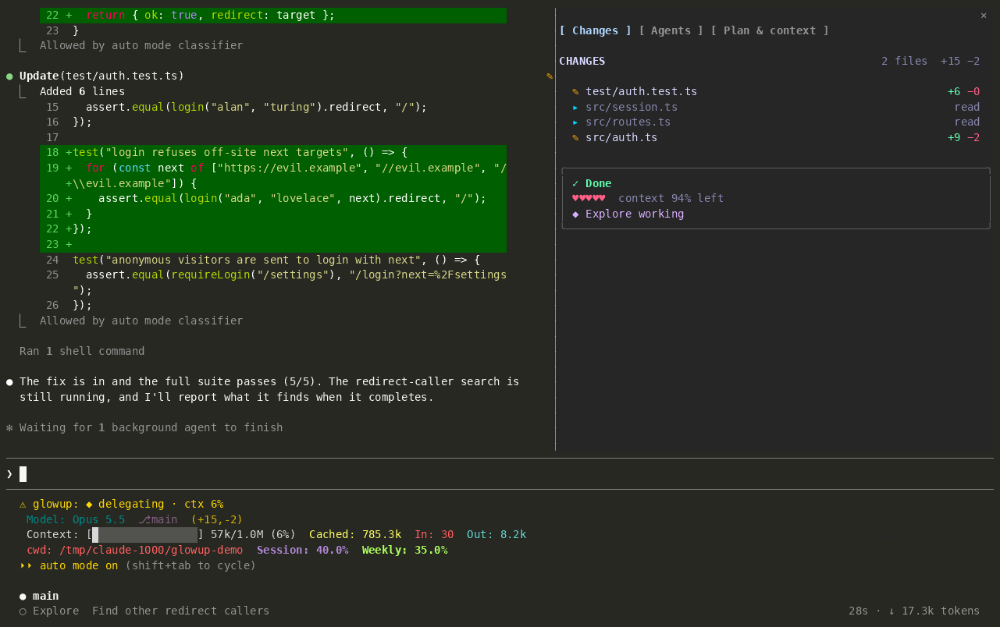
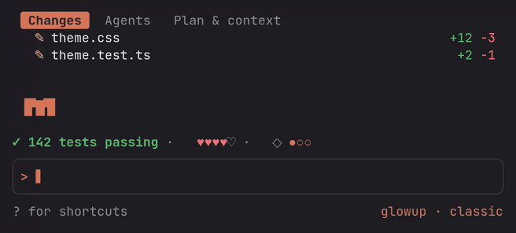
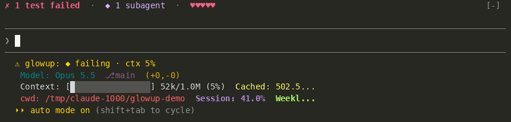

## Three tiers

glowup chooses a layout by terminal width. In every tier it draws beside or above Claude Code's transcript and prompt without moving them.

| Tier | When | What you see |
| --- | --- | --- |
| Wide | The glowup pane is docked beside the transcript | The full pane, with Clawd at the bottom. The band is hidden because the pane already shows the same information. |
| Medium | 80 columns or more, and the pane is not docked | The band above the prompt. The pane opens as a drawer when you ask for it. |
| Compact | Under 80 columns | A shortened band. The drawer is a tab strip and at most six rows. |

### When the pane docks

In fullscreen, glowup asks Claude Code once to open its pane, but Claude Code only docks a pane the user did not open at 144 columns or more. After you have opened the pane yourself, it docks from 110 columns. Below that, the band is shown instead.

Clawd only ever appears in the pane; see [Pets](pets.md).

### The drawer

Below the docking width, `/glowup pane` opens the pane as a drawer above the prompt, and Esc or the same command closes it. When the drawer is narrower than 80 columns, each tab uses its compact form.

## The band

The band is one line above the prompt. It appears while Claude works and folds away 1.5 seconds after the turn ends, unless background subagents are still running, in which case it stays with the action shown as `delegating`. At the end of a turn the action reads `✓ Done`, `■ Interrupted` if you interrupted it, or `✗ Stopped` after an error or a refusal.

From left to right it shows:

- The current action with its glyph and color, for example `✎ Editing auth.ts`. Failures show in the `fail` color and passes in the `pass` color.
- The number of running subagents, for example `◆ 2 subagents`.
- Five hearts for the context you have left, each worth 20% of the window.
- Plan progress as pips, `●●○○`, when Claude has a task list.
- With a pack that turns them on, an HP bar in place of the hearts and a `COMBO x3` tag. See [Extras](pack-reference.md#extras).

When the line is too long, the action text is shortened first. If the rest of the line would leave the action fewer than 8 columns, the band drops everything but the action. The band is also hidden while Claude Code's feedback survey is open and while you view a subagent's transcript.

## The tabs

The pane has three tabs, selected with their number key or by clicking. In the docked pane each tab is a box in the pack's border style, with the section name and its counts in the top edge; the compact drawer draws no boxes.

Under the tabs in the wide pane, a status box shows the current action, the running subagents and a row of hearts. These hearts show account usage: whichever of the 5-hour and weekly limits has less left, for example `♥♥♡♡♡  weekly limit 38% left`. On an API key, which has no such limits, the row shows the session's spend instead, such as `$4.20 spent this session`. Until the first usage reading arrives, the hearts show context.

### Changes

Every file that changed during the session, or `Nothing changed yet.`

- Each file shows `+added −removed`, and new files are marked `new`.
- The box's top edge shows the number of edited files and the total lines added and removed.
- In a git repository the counts come from `git diff --numstat` against a snapshot taken at session start, so files you had already modified before the session are not listed, while files changed by shell commands during it are. New untracked files, and sessions outside git, use the line counts from the edit itself.
- glowup runs git without taking locks, so it does not hold up Claude's own git commands.
- The compact form lists edited files only.

### Agents

Each subagent started this session, or `No subagents this session.` The tab keeps updating while background subagents run after the main turn ends.

- Name, elapsed time, token count, and a spinner while it runs or a check mark when it is done.
- Its task description.
- While it runs, the tool it is using now.
- With reduced motion on, the spinner is a still mark.
- The compact form is one line per subagent.

### Plan & context

The tab has two boxes, `PLAN` and `CONTEXT`, one blank row apart.

- `PLAN` is Claude's task list. `◉` is in progress (bold, with its active wording when the task has one), `○` is next, `✓` is done. In progress comes first, then next, then the last three done, dimmed, with `+N more done` for the rest. The top edge shows done over total.
- The list is Claude Code's saved one, read from `tasks/<list>/*.json` under your config directory when the session starts and again after each `TaskCreate` or `TaskUpdate` Claude makes. `<list>` is `CLAUDE_CODE_TASK_LIST_ID` when that is set, otherwise the working directory with every character outside letters and digits turned into `-` and the leading `-` dropped (`/home/you/Projects` is `home-you-Projects`). Deleted and unreadable tasks are skipped. Subagent task calls do not count. A `TodoWrite` list still shows too.
- `CONTEXT` has one stacked bar: each part of the context that uses tokens is its own colored segment, biggest first, and free space is a faint `░` track (`·` when the theme gives no usable colors). Segment colors come from your theme's `read`, `agent`, `shell`, `edit` and `accent` colors, so they follow the pack. If the theme gives no usable colors, the segments use the block shades `█▓▒░` instead. The top edge shows the percent and tokens, such as `62% · 124k / 200k`.
- Under the bar, a legend names each part with its share (`● messages 31%`) and wraps onto more lines when the pane is narrow. Up to five parts get their own segment and the rest join as `other`.
- A `┊` on the bar marks where auto-compact runs. It is absent when auto-compact is off.
- Below the legend, a two-row braille chart of the context percent, one sample per finished turn. A compaction shows as a drop. The chart's top, printed at the right end of its first row, is the auto-compact point once the session is within half of it, and a dashed rule marks that point. Until then the top sits a little above the session's peak, so a small session on a large window still has a visible shape. Each turn gets a full cell until the chart is full, then two turns share a cell. The chart shows once there is a sample.
- Under the chart, how fast the context grows and when auto-compact will run, such as `+7k/turn · auto-compact in ~6 turns`. The growth is averaged over the last six turns since the last compaction. The line says `auto-compact off` when it is off.
- Next, up to three of the heaviest sources you can trim, each with its tokens: an MCP server's loaded tool schemas (`mcp  linear  38 tools  14k`), a memory file such as a `CLAUDE.md`, the skill listing, or the custom agent listing.
- The last line shows the prompt cache's share of the last request's input, the session's peak, and the number of compactions, such as `cache hit 92% · peak 81% · compacted 1×`.
- From 70% used, a warning line names the biggest part.
- The compact form is the checklist and one line with the stacked bar, its auto-compact mark, and the percent.
- Without a task list, `PLAN` says `No task list yet.`

A mod cannot hide Claude Code's own task list, so the plan shows in both places.

The tabs do not respond to selection yet; opening a file's diff or a subagent's tool calls is on the [roadmap](roadmap.md).
