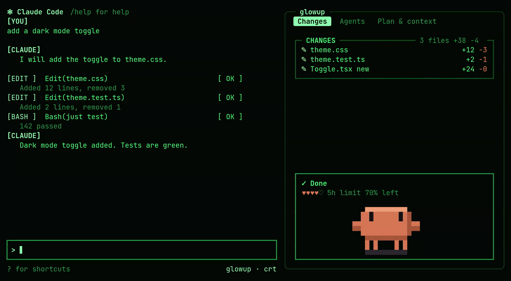
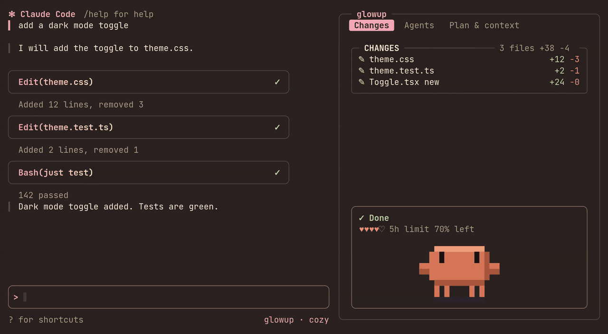
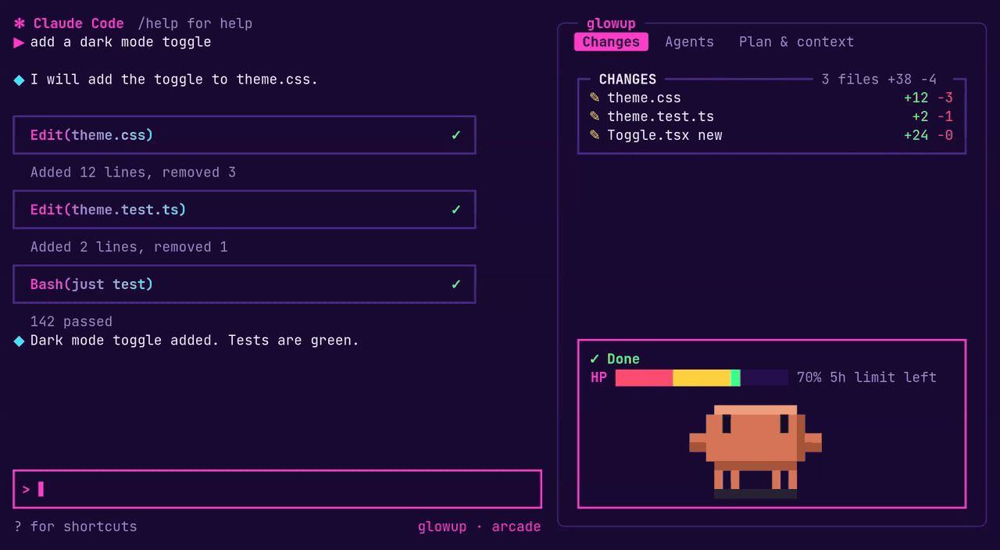

A pack decides how glowup looks: the colors, how your prompts and Claude's replies are framed in the transcript, the border style of the pane, and the spinner. Switching packs restyles all of it at once.

```text title="claude code"
/glowup pack arcade
```

## The built-in packs

**classic** is the default. It keeps Claude Code's own look and only adds glowup's pane, band and pet.

**crt** is green phosphor on near-black, with retro tags such as `[YOU]` and `[ OK ]` on the transcript rows and a comet spinner.



**cozy** uses warm pastels, rounded cards with a pink-to-cream gradient, and a spinner made of two blinking eyes.



**arcade** is neon on deep purple. Rows get bold cards with arrow and diamond markers and an XP tag, the context hearts become an HP bar, a combo counter climbs as tool calls succeed, and the spinner changes with what Claude is doing.



## Mixing and adjusting

A pack has two parts that can be changed separately: its colors (palette, row style, borders) and its motion (the spinner and its shimmer). You can keep one pack and change pieces of it:

- `/glowup theme dusk` swaps in a different palette while keeping the pack's row style and borders. See [Making a theme](themes.md).
- `/glowup spinner eyes` changes just the spinner.
- `/glowup color accent #ff8a4c` overrides a single color, and the override stays when you switch pack or theme.

Choosing a pack again with `/glowup pack` clears any theme or spinner you put on top of it. `/glowup pack list` shows what you have, and when your look is a mix it names where each part comes from.

If one part of a pack fails to load, glowup uses classic for that part only and tells you why. The other parts still load.

## Making your own

The quickest way is to ask Claude. glowup ships a skill that knows the pack format, so you can say "make me a glowup pack from this palette", hand it an image or a terminal color scheme, or ask it to "make arcade less pink". Claude writes the file, checks that the text stays readable against the background, and tells you which command applies it. To change a built-in pack, it writes a new pack based on it.

If you already have a terminal color scheme, `/glowup import <file>` turns a Ghostty theme or a base16 file into a pack and applies it.

To keep a look you have put together from a pack, a theme and some overrides, run `/glowup pack save <name>`. The saved file is self-contained, so you can share it.

The file format, its limits and every option are in the [pack reference](pack-reference.md).

## Sharing

Host the pack file anywhere it can be fetched over `https://`, such as a gist or a raw file on GitHub. Anyone can then install and apply it with:

```text title="claude code"
/glowup pack https://example.com/neon.json
```

A pack is plain data that glowup validates before installing, so installing one cannot run code.

A studio link carries the whole pack inside it, so you can share a look without hosting a file. Paste it after /glowup pack.

## Limits

A pack restyles the transcript rows, glowup's own pane and band, and the spinner line. Claude Code's logo, prompt box and status bar stay as they are, and a mod has no way to hide Claude Code's own task list.

A custom spinner replaces Claude Code's whole spinner line, including the token count, which Claude Code does not pass to mods. The stock spinner keeps it.
