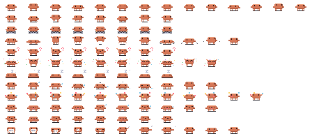

## The sheet

A pet is one PNG. Every frame sits in a cell 32 pixels wide and 16 tall, each animation has its own row, and the frames of a row run left to right. The first empty cell ends the row.



[Download the template](assets/pet-template.png) to start from Clawd's frames.

- The sheet is 192 px tall (12 rows of 16 px) and `32 × (your longest row)` px wide. A row can have 32 frames at most.
- Only `idle` is required. A pet that has no row for an animation plays `idle` instead, except that a missing `fail` plays `alert` and a missing `pant-walk` plays `walk`.
- A pixel with alpha below 50% is transparent. Fully opaque pixels keep their exact color. The browser can shift the color of a semi-transparent pixel by 1 per channel when it reads the PNG, so soft edges can add near-duplicate colors; export without anti-aliasing. The sheet can have at most 60 colors.
- Art smaller than a cell is fine. The studio trims every frame to the smallest box that holds them all, and the pane gives the pet one terminal row for every two pixel rows of that box. Clawd is 24 × 12, so he takes six rows; the robot uses the full 32 × 16.

## The rows

The rows run top to bottom in this order. The frame time is how long each frame shows by default; you can change it per row in the studio.

| Row | When glowup plays it | Frame time | Plays |
| --- | --- | --- | --- |
| `idle` | Nothing is happening | 400 ms | Loops |
| `walk` | Claude reads, searches or plans | 110 ms | Loops |
| `working` | Claude edits files or runs commands | 120 ms | Loops |
| `hop` | A test passes | 120 ms | Once |
| `alert` | Claude needs your approval | 180 ms | Loops |
| `done` | A turn ends | 120 ms | Loops |
| `sleep` | Nothing has happened for a while | 450 ms | Loops |
| `fail` | A test fails | 250 ms | Once |
| `juggle` | Three or more subagents are running | 110 ms | Loops |
| `pant` | The context window is nearly full | 290 ms | Loops |
| `pant-walk` | The same, while walking | 140 ms | Loops |
| `scrunch` | The context is compacted | 150 ms | Once |

See [Pets](pets.md) for what each moment looks like on Clawd.

## Movement

`walk` and `pant-walk` move the pet one pixel to the right for every frame. Draw them facing right: glowup mirrors them for the walk back. The other rows stand still, so draw them in place.

## Making the pet

1. Open the [studio](https://glowup.khimani.dev/studio) and go to the Pet section.
2. Upload your PNG, give the pet a name, and set the speed of each row.
3. Choose Send to my Claude in the studio's top bar to copy a `/glowup pack …` command, and paste it into Claude Code to install the pet and switch to it. A pet fits in the link when its encoded part is under 4 KB, and the studio tells you when it is too big. For a bigger one, choose Download pet instead.
4. For a downloaded file, run the command below with the path of your download, then switch to the pet.

```text title="claude code"
/glowup pet add ~/Downloads/<name>.json
/glowup pet <name>
```

`/glowup pet add` also takes an `https://` URL to a pet file. It installs the pet in `~/.claude/glowup/pets` (under `$CLAUDE_CONFIG_DIR` if you set it) without switching, and it refuses a name you already have unless you add `--force`.

## The pet file

The studio writes a JSON file, and you can write one by hand. This is the smallest pet that works:

```json
{
  "format": 1,
  "name": "dot",
  "palette": { "A": "#ff8a3d" },
  "animations": {
    "idle": [
      { "ms": 400, "px": ["..AA..", ".AAAA.", "..AA.."] }
    ]
  }
}
```

Each `px` row is a string with one palette key per pixel, and `.` is a transparent pixel, so it cannot be a palette key. The rules:

- The file is at most 64 KB.
- `name` is lowercase letters, digits and dashes, starts with a letter or digit, and is at most 40 characters. `clawd`, `clawd-shiny`, `robot` and the `/glowup pet` subcommands are taken.
- `palette` maps single characters to `#rrggbb` colors, 60 at most.
- Frames are at most 32 pixels wide and 16 rows tall, and every frame in the file is the same size.
- `ms` is a whole number from 80 to 10000.
- A row has at most 32 frames, and the animation names are the ones in the table above.
- A frame can also set `dx`, a whole number from -4 to 4 for how many pixels the pet travels right when the frame shows, and `exit: true` to mark a neutral frame where glowup may cut away to the next animation. The last frame of a row that plays once counts as one. An optional `description` is at most 80 characters.
