## Clawd

Clawd is a pixel pet who sits at the bottom of the glowup pane and reacts to what Claude is doing. He is drawn in half-block characters in Claude Code's orange and keeps his colors under every pack and theme. He is on by default. The [robot](#the-robot) and [pets you draw yourself](#your-own-pet) are the alternatives.

He only appears in the pane, so you see him when the pane is docked beside the transcript or opened as a drawer with `/glowup pane`. A drawer narrower than 80 columns shows a one-row Clawd, `▐▛█▜▌`, instead of the full sprite. Other pets show `▗▟█▙▖` in their main color. Reduced motion and `/glowup pet off` both hide him.

## What he does

| | |
| --- | --- |
| 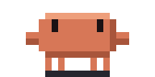 | When nothing is happening he stands around and blinks. |
|  | While Claude edits files or runs commands, he types at his keyboard. |
| 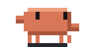 | While Claude reads, searches or plans, he paces back and forth. |
|  | With three or more subagents running, he juggles them. |
| 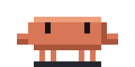 | A passing test makes him hop. |
|  | A failing test makes him sag and sweat, and the sweat drop stays until your next prompt. |
| 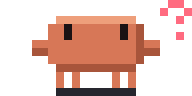 | When Claude needs your approval, he startles and then waits with a question mark beside him. This happens only when Claude Code opens a permission dialog, so he does not react in auto mode, including when the auto-mode check hands a call to you. |
| 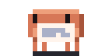 | When the context is compacted, he crumples up a sheet of paper and tosses it. |
| 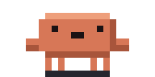 | By default, once the context window is 80% full, he pants. |
| 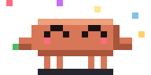 | At the end of a turn he does a little dance. |
| 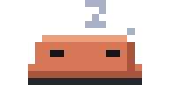 | By default, after a minute with nothing happening he falls asleep, and stretches when something wakes him. |

On a Friday after 15:00, a deploy command gets him into a sweat outfit.

His frames change at most every 80 ms and nothing flashes more than 2.5 times a second. In the narrow drawer he does not animate.

## The robot

The robot is the CRT monitor that is the mascot of the crt pack, drawn at 32 × 16 pixels. Pick it with `/glowup pet robot`.

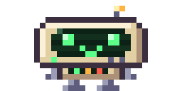

It reacts to the same moments as Clawd, without his outfits.

## Speech bubbles

With bubbles on, the pet says a short line (40 characters at most) at the moments listed under [What pets say](#what-pets-say), and the bubble stays for 3 seconds by default. Lines come from a set of templates per moment, never the same one twice in a row, and some fill in details such as the failure count or the command. In the narrow drawer the line appears beside the one-row pet. Choose which moments get a bubble and how long it stays with /glowup setup bubbles.moods and /glowup setup bubbles.ms.

```text title="claude code"
/glowup bubbles off
/glowup bubbles on
/glowup bubbles haiku
```

### What pets say

A bubble is about one moment. There are eight, and all are on by default.

| Moment | When it speaks |
| --- | --- |
| `done` | A turn ends with an answer. |
| `fail` | A test run fails. |
| `needs-you` | A permission dialog opens. |
| `green` | A test run passes after a failed one in the same session. |
| `hello` | The pane is first drawn in a session, unless another bubble spoke first, and when a turn starts after 30 minutes away. |
| `long-done` | A turn that ran 5 minutes or more ends with an answer. |
| `compact` | The context is compacted. |
| `level-up` | A turn takes you to a new [level](#levels). It replaces that turn's `done` or `long-done` line and names what you unlocked. |

Clawd, the robot and the egg each have their own lines, about six per moment: Clawd is dry and warm, the robot reports in capitals, and the egg mostly makes small sounds. `clawd-shiny` uses Clawd's. A pet you draw yourself speaks a neutral default line unless its file carries [its own lines](pet-sprites.md#lines-and-voice).

Lines also change with the clock. Mornings, afternoons, evenings and nights add their own lines to the pool, and so do Fridays and the holiday outfits (Christmas, Halloween and your install anniversary).

To silence a moment, list the ones you want to keep:

```text title="claude code"
/glowup setup bubbles.moods done,fail,needs-you,green
```

With `long-done` off, a long turn speaks a plain `done` line. With `level-up` off, the turn that reaches a new level shows its `done` line instead.

A setup that lists every moment its glowup version knew counts as "all moments", so a new moment such as `level-up` reaches you if you never turned one off. That covers the old default, `needs-you,fail,done`, and the seven moments before `level-up`. Any other list is kept as you saved it, and you add a new moment to it yourself.

### Lines written by Haiku

With `/glowup bubbles haiku`, glowup sometimes asks Claude Haiku for the line. The template line shows first, and Haiku's replaces it only if the reply arrives while that bubble is still up, so the bubble is drawn without waiting for the call.

**Cost.** Each line is a small Haiku call billed to your account, made with your session's credentials.

`hello`, `compact` and `level-up` lines never use Haiku. Haiku speaks as the pet, using the pet's voice: built in for Clawd, the robot and the egg, and the `voice` key in a [custom pet file](pet-sprites.md#lines-and-voice).

What it sends: the moment, the pose, the short label glowup already shows for the current tool, a test summary such as `failed 3`, and the time of day. It never sends your prompts, file contents, code or secrets. The reply is cleaned to one plain line of at most 40 characters; an empty reply falls back to the template.

glowup makes one call at a time, at most one per turn, at least 90 seconds apart, and abandons a call after 4 seconds. After an error or a timeout, and always in a `-p` run, under reduced motion or with the pet off, the template line stays and nothing is retried. Errors go to the debug log only.

## Choosing a pet

`/glowup pet clawd|robot|off` picks Clawd, the robot, or no pet. `/glowup pet list` shows the pets you can pick: Clawd, the robot, the shiny one once you have earned him, the egg once you have unlocked it, and any pet you have installed. The Pet row in `/glowup config` cycles through the same list, and the Bubbles row changes the bubbles.

## Your own pet

You can draw a pet as a PNG sprite sheet, convert it in the [studio](https://glowup.khimani.dev/studio), and install it with `/glowup pet add` or a studio link. The sheet layout, the animation rows and the install steps are in [Pet sprites](pet-sprites.md).

## The shiny pet

Keep your tests green and see what happens. When it does, glowup tells you, and `/glowup pet clawd-shiny` switches to a gold Clawd. Progress toward it carries across sessions.

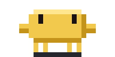

## The egg

There is a secret egg. Click the pet in the pane and it hops. A click gives the pet the keyboard, and Esc hands it back to the prompt. While it has the keyboard, type the secret code at the pet to unlock the egg, then press Esc and pick it with `/glowup pet egg`. Until then the command prints `The egg is not unlocked yet.`, and the egg stays out of `/glowup pet list` and the Pet row in `/glowup config`.

The egg wobbles while Claude works. After the unlock it gets a crack every 10 passing test runs, up to three. It does not hatch.

Clicking and typing at the pet needs a terminal where Claude Code receives mouse clicks, and the pet has to be in the pane: docked, or in the drawer from `/glowup pane`.

## Levels

Working with Claude earns XP. All your pets share one level, and it carries across sessions.

| Source | XP |
| --- | --- |
| A turn that ends with an answer | 5 |
| The turn's combo, up to 20, on an answered turn | up to 20 |
| Tests going green | 15 |
| Each `git commit` Claude runs, at most 3 a turn | 10 |

Subagents earn nothing. Only `git commit` calls Claude itself runs in the main conversation count; commits run by a subagent, or by you in your own terminal, do not.

Level n needs 100 × n XP to reach level n + 1, so level 2 comes at 100 XP and level 10 at 4,500. Levels never end, but every unlock sits in the first ten.

| Level | Unlocks |
| --- | --- |
| 2 | New lines |
| 3 | An outfit |
| 4 | New lines |
| 5 | A new move (idle) |
| 6 | An outfit |
| 7 | New lines |
| 8 | An outfit |
| 10 | A new move (idle) |

Outfits and moves are coming in a later release. Until then they are earned but not shown, and the level-up bubble names only the lines.

When a turn takes you up a level, the pet speaks the [`level-up`](#what-pets-say) moment instead of its done line. It names the unlock when there is one. To turn this off, leave `level-up` out of the moments you keep with `/glowup setup bubbles.moods`.

The pane shows your level and a ten-cell XP bar on the activity row when the row is wide enough. The status line shows them with the opt-in [`level` field](statusline.md#choosing-the-fields). `/glowup level` prints your level, your XP, the XP to the next level, what you have unlocked and the next unlock.

If two sessions finish a turn at the same instant, one turn's XP can be lost. This is rare.

## Outfits

Clawd dresses up on some dates and at some hours, by your computer's local time:

- A Santa hat from 20 to 31 December.
- A pumpkin from 25 to 31 October.
- A party hat on the anniversary of the day you installed glowup.
- A nightcap between 23:00 and 04:59.

There are a few more that this page does not list.
